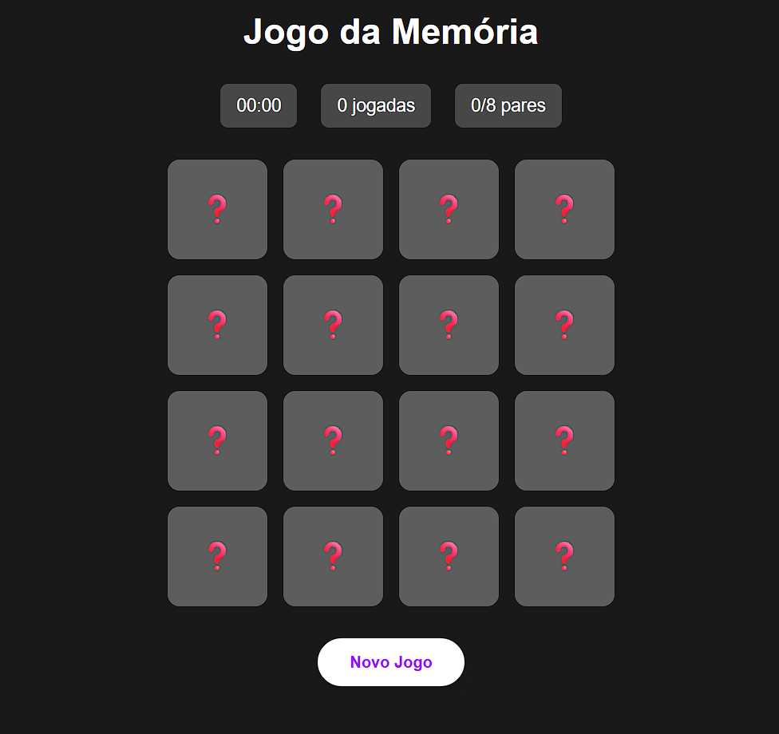

<h1 align="center">

  <p>Jogo da Memória</p>
  <p>
    
    
    
  </p>
</h1>

**Jogo da Memória** é uma aplicação web desenvolvida com **Next.js** e **React**, onde o objetivo é encontrar todos os pares de cartas no menor número de jogadas e no menor tempo possível.

---

## 📸 Visualização do Projeto

<p align="center">
  
</p>

---

## 🚀 Funcionalidades

| Funcionalidade | Descrição |
|----------------|-----------|
| 🃏 **Virar cartas** | Clique para revelar e encontrar os pares |
| ⏱️ **Cronômetro** | Tempo começa a contar na primeira jogada |
| 🔢 **Contador de jogadas** | Registra o número de tentativas |
| 🏆 **Modal de vitória** | Exibe estatísticas ao completar o jogo |
| 🔄 **Reiniciar** | Embaralha e reinicia o jogo a qualquer momento |

---

## 🛠️ Tecnologias Utilizadas

<div align="center">
  
  
  
  
</div>

---

## 📚 Conceitos Aplicados

- Componentes funcionais com TypeScript
- Hooks: `useState`, `useEffect`
- Lógica de embaralhamento e verificação de pares
- Cronômetro reativo com `setInterval`
- Estilização com Tailwind CSS v4

---

## ▶️ Como Rodar o Projeto

```bash
# Clone o repositório
git clone https://github.com/DanielVerissimo1/jogo-da-memoria

# Instale as dependências
npm install

# Inicie o servidor de desenvolvimento
npm run dev
```

Acesse [http://localhost:3000](http://localhost:3000) no navegador.

---

## 📁 Arquitetura do Projeto

```
jogo-da-memoria/
│
├── src/
│   ├── app/
│   │   ├── globals.css
│   │   ├── layout.tsx
│   │   └── page.tsx
│   └── components/
│       ├── MemoryGame.tsx    # Lógica principal do jogo
│       ├── GameBoard.tsx     # Grade de cartas
│       ├── GameStats.tsx     # Estatísticas (tempo, jogadas, pares)
│       ├── RestartButton.tsx # Botão de reinício
│       └── VictoryModal.tsx  # Modal de vitória
├── public/
│   └── favicon.png
└── README.md
```
